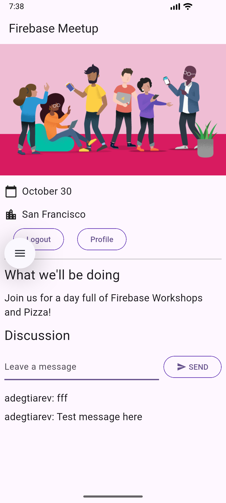

# Flutter Guestbook Demo Project with Firebase

This is a simple demo project that shows how to integrate Flutter with Firebase services. The application is a guestbook where users can authenticate and leave messages.



## Features

*   **Authentication:** Sign in using email and password via Firebase Authentication.
*   **Guestbook:** Authenticated users can add messages to a public guestbook.
*   **Real-time Database:** Messages are stored in Cloud Firestore and displayed in the app in real-time.

## Technologies Used

*   **Flutter:** Framework for building cross-platform applications.
*   **Firebase:**
    *   **Firebase Authentication:** For user management.
    *   **Cloud Firestore:** NoSQL database for storing messages.
    *   **Firebase Core:** for initializing Firebase.
*   **Provider:** For application state management.
*   **go_router:** For app navigation.

## Getting Started

1.  **Clone the repository:**
    ```bash
    git clone <REPOSITORY_URL>
    cd <PROJECT_NAME>
    ```

2.  **Set up Firebase:**
    *   Create a new project in the [Firebase console](https://console.firebase.google.com/).
    *   Add a Flutter app to your Firebase project and follow the setup instructions for Android, iOS, or Web.
    *   Enable **Authentication** (Email/Password provider) and **Cloud Firestore** in your Firebase console.

3.  **Install dependencies:**
    ```bash
    flutter pub get
    ```

4.  **Run the application:**
    ```bash
    flutter run
    ```
